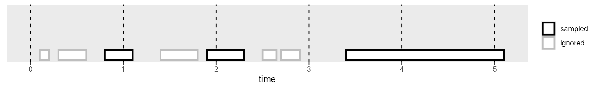
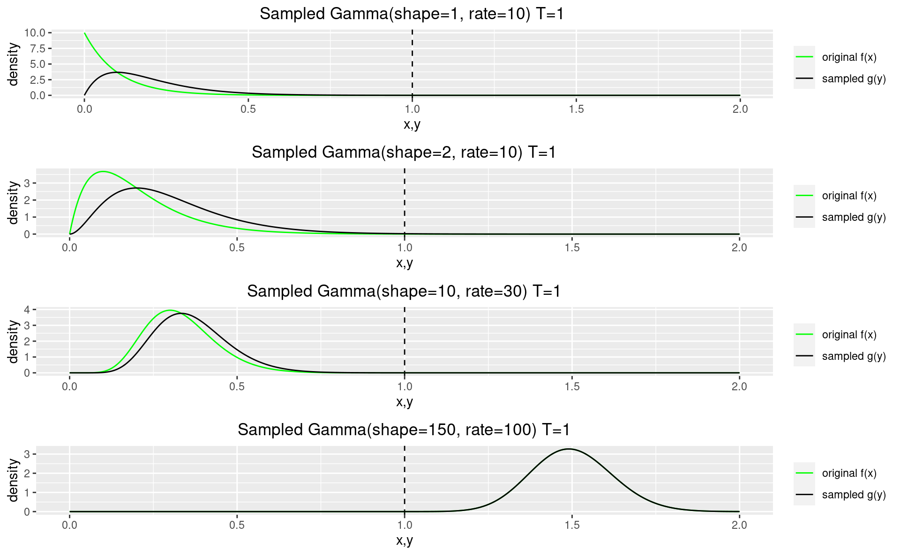
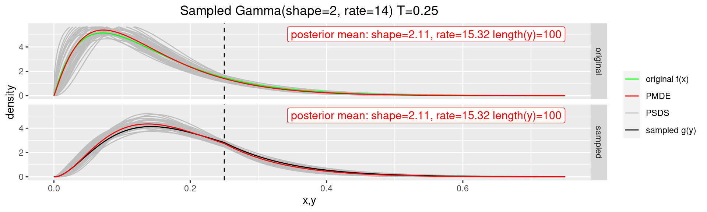

*This is a short summary only; the full study is available at:*   
*https://github.com/alberto-dellera/sampling_event_duration/blob/master/root/full_study/sampling_event_duration.pdf*

We will study an event sampling process whose sampling period is uniform:

The process samples the duration of the events that are active ("in-flight") at sample time, and ignores all the others. 

We will derive the probability distribution of the sampled durations given the original durations distribution in general, but focusing on the versatile Gamma distribution:

We will build random generators to simulate the sampling process, and then design a Bayesian estimator to infer back the original distribution parameters, implemented in Stan: 

*https://github.com/alberto-dellera/sampling_event_duration/blob/master/root/full_study/sampling_event_duration.pdf*

